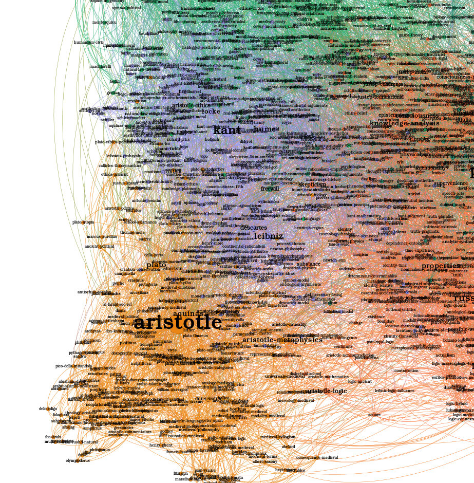

# Navigating a Knowledge Base

## Using Learned Representations for Encyclopedia Navigation

### Case study: [Stanford Encyclopedia of Philosophy](https://plato.stanford.edu/contents.html) and [Wikipedia Philosophers](https://en.wikipedia.org/wiki/Lists_of_philosophers)

Rendered notebooks accessible here: [nbviewer](https://nbviewer.jupyter.org/github/cakiki/philosophy-graph/tree/main/notebooks/)

